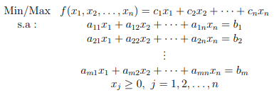

## Implementação do algoritmo Simplex

Esse repositório contém uma implementação do algoritmo Simplex pelo método das duas fases.

Ele recebe um arquivo com extensão **.cplex.lp** que contém um problema de otimização linear na seguinte forma:

Foi um trabalho feito para a disciplina de Pesquisa Operacional, do sétimo período do curso de Ciência da Computação da Universidade Estadual do Centro-Oeste.

### Como rodar

É necessário a instalação da biblioteca **CPLEX** pelo seguinte comando:

`pip install cplex`

Para rodar é utilizado o seguinte comando:

`python3 simplexSolver.py "./testCases/nome-do-arquivo.cplex.lp"`

### To-do

- Tratamento das bounds quando for diferente de uma bound **>= 0** (provavelmente tem em algum lugar da documentação da biblioteca Cplex).
- Deixar o output no terminal melhor.

### Créditos
Documentação da [biblioteca Cplex para Python](https://www.ibm.com/docs/en/icos/12.9.0?topic=SSSA5P_12.9.0/ilog.odms.cplex.help/refpythoncplex/html/cplex-module.htm)